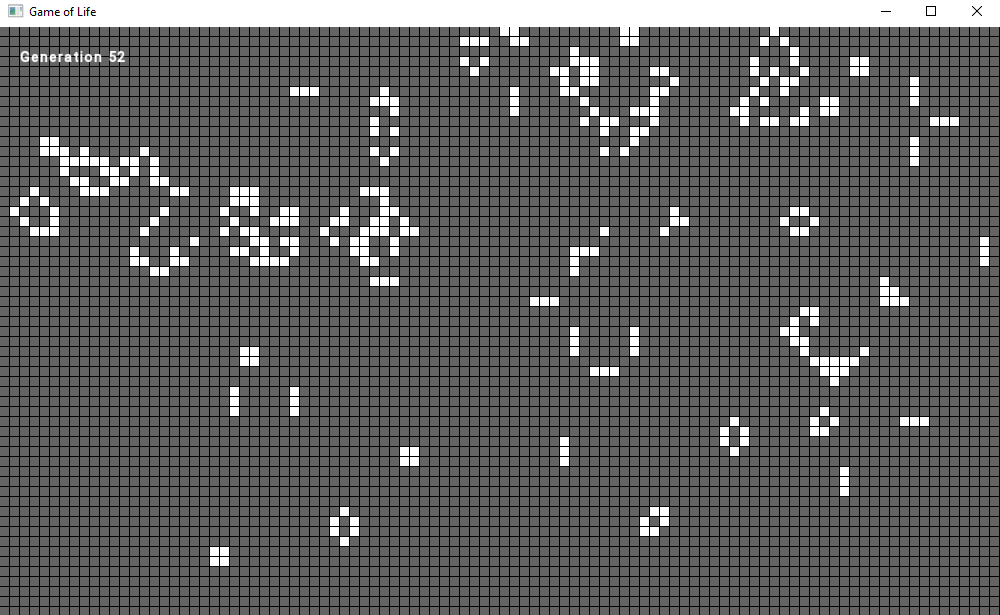
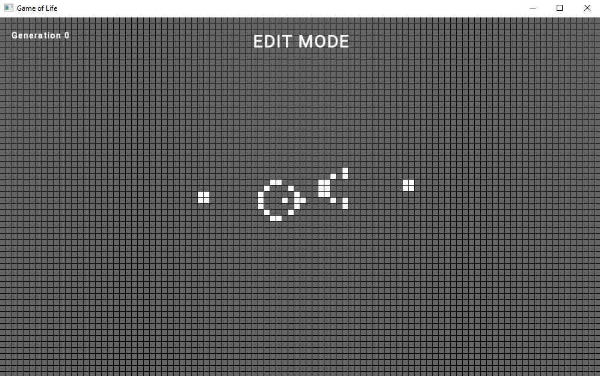
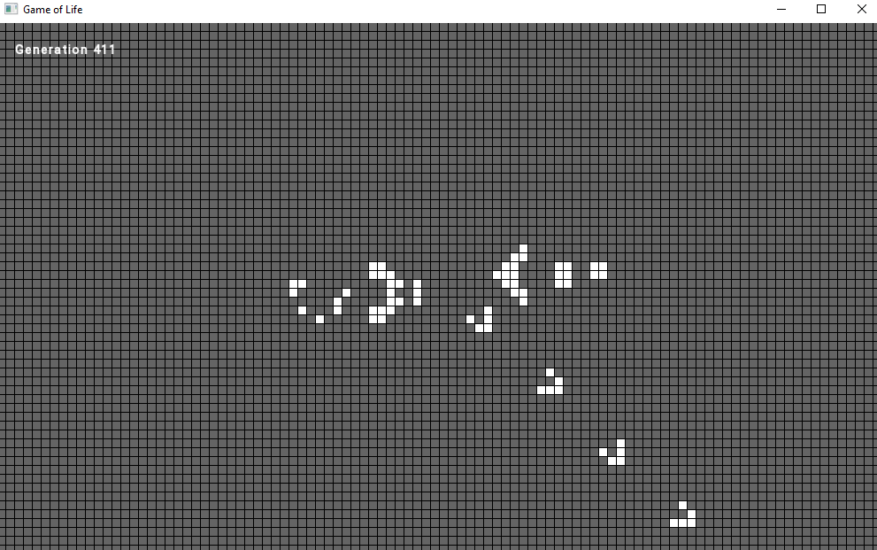

# game-of-life

Simple C++ implementation of the [Conway's Game of Life](https://en.wikipedia.org/wiki/Conway%27s_Game_of_Life) with [SFML](https://www.sfml-dev.org/index.php)

 

# How to use
`space`: pause/unpause
 `r`: reset cells
 `left click`: add cells (only in pause)
 `right click`: remove cells (only in pause)

 

# Example
Input:
 

Result:
 